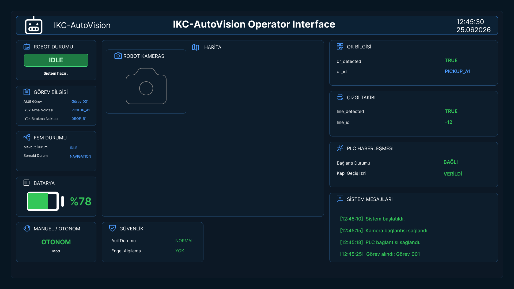

# 🤖 IKC-AutoVision | Operator Interface

Bu proje, otonom mobil robot ve görüntü işleme sistemleri için tasarlanmış modern bir **Operatör Kontrol Arayüzü (Dashboard / HMI)** çalışmasıdır.

---

## 📸 Arayüz Görünümü

  

---

## 🛠️ Panel Bileşenleri & Özellikler

Arayüz; sahadaki otonom operasyonların tek merkezden, anlık ve hatasız takibi için modüler olarak tasarlanmıştır:

- **🤖 Robot & FSM Durumu:** Robotun anlık modu (`IDLE`, `NAVIGATION`), sonlu durum makinesi (FSM) geçişleri ve sistem hazır bilgisi.
- **📋 Görev & Rota Bilgisi:** Aktif görev kimliği (`Görev_001`), yük alma noktası (`PICKUP_A1`) ve bırakma noktası (`DROP_B1`).
- **📷 Robot Kamerası & Harita:** Canlı kamera akışı ve saha konumlandırma/harita takip pencereleri.
- **🔍 Görüntü İşleme & Takip:**
  - **QR Bilgisi:** Gerçek zamanlı tespit (`qr_detected: TRUE`) ve okunan lokasyon verisi.
  - **Çizgi Takibi:** Çizgi algılama durumu ve sapma açısı/hata değeri (`line_id: -12`).
- **🔌 Endüstriyel Haberleşme (PLC):** PLC bağlantı durumu ve saha içi kapı geçiş izin onayları.
- **🛡️ Güvenlik & Batarya Takibi:** Batarya doluluk oranı (`%78`), acil durum kontrolü ve optik/engel algılama sensör teyidi.
- **📝 Sistem Logları (Terminal):** Gerçek zamanlı olay, bağlantı ve durum kayıtları.

---

## 🎨 Tasarım Araçları
- **Figma** (UI/UX Tasarımı, Grid & Auto Layout, Dark Theme HMI)
